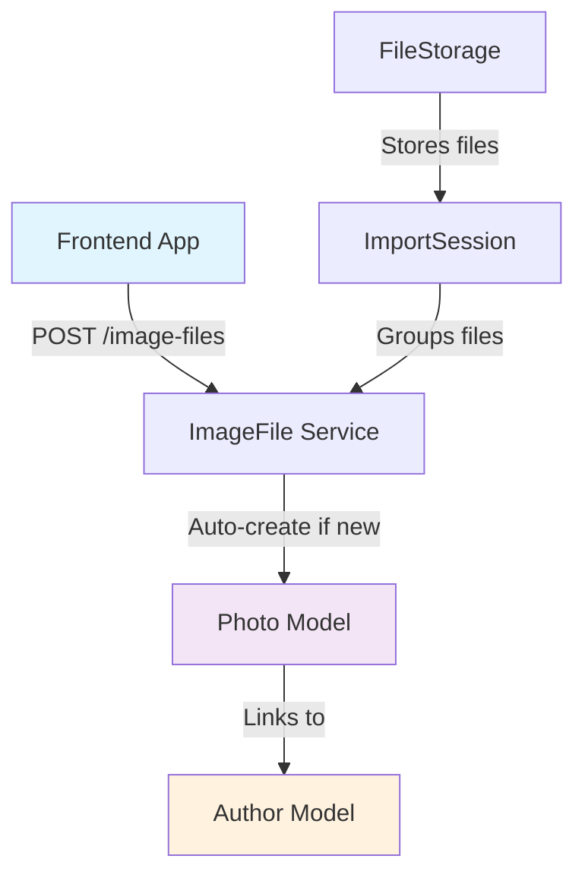

# Brukeradministrasjon i ImaLink: Arkitektur og Alternativer

## 📋 Nåværende Arkitektur - Single User System

### Current State Analysis

ImaLink er i dag designet som et **single-user system** med følgende karakteristika:

#### 🏗️ **Database Schema Analyse**

**Eksisterende modeller:**
- `Photo` - Inneholder visual data og metadata
- `ImageFile` - Fysiske filer med EXIF og hotpreview
- `ImportSession` - Import batches med user metadata
- `FileStorage` - Fysiske storage locations
- `Author` - Fotografer (kan være forskjellige fra app-brukere)

**Nåværende "bruker"-konsept:**
- **Author** modell eksisterer, men representerer **fotografer** (hvem som tok bildet)
- **Ingen autentisering/autorisasjon** i systemet
- **Ingen session management** eller user tracking
- **Alle data er globalt tilgjengelige** via API

#### 🔍 **Dagens Datastrøm**



**Observasjoner:**
- Alle API-kall er anonyme
- Ingen user context i requests
- Data isolation basert på `ImportSession` eller `FileStorage`, ikke brukere

---

## 🎯 Multi-User Arkitektur: Alternativer og Implikasjoner

### Alternativ 1: **User-Scoped Data (Tenant per User)**

#### Konsept
Hver bruker får sitt eget "namespace" - alle data isoleres per bruker.

#### Database Design
```python
# Ny User modell
class User(Base, TimestampMixin):
    id = Column(Integer, primary_key=True)
    username = Column(String(50), unique=True, nullable=False)
    email = Column(String(255), unique=True, nullable=False)
    password_hash = Column(String(255), nullable=False)
    display_name = Column(String(255))
    is_active = Column(Boolean, default=True)
    role = Column(String(50), default='user')  # 'admin', 'user'

# Alle eksisterende modeller får user_id
class Photo(Base, TimestampMixin):
    hothash = Column(String(64), primary_key=True)
    user_id = Column(Integer, ForeignKey('users.id'), nullable=False, index=True)  # NEW
    # ... resten som før
    
class ImportSession(Base, TimestampMixin):
    id = Column(Integer, primary_key=True)
    user_id = Column(Integer, ForeignKey('users.id'), nullable=False, index=True)  # NEW
    # ... resten som før

class FileStorage(Base, TimestampMixin):
    id = Column(Integer, primary_key=True)
    user_id = Column(Integer, ForeignKey('users.id'), nullable=False, index=True)  # NEW
    # ... resten som før
```

#### Fordeler
- ✅ **Komplett dataisolering** mellom brukere
- ✅ **Enkel tilgangskontroll** - filter på user_id
- ✅ **Privat data** - ingen risiko for datalekkasjer
- ✅ **Skalerer godt** - hver bruker uavhengig

#### Ulemper
- ❌ **Omfattende migrering** - alle tabeller må endres
- ❌ **Ingen deling** mellom brukere
- ❌ **API breaking changes** - alle endpoints må endres
- ❌ **Storage kompleksitet** - hver bruker trenger egen FileStorage

### Alternativ 2: **Shared Data med Access Control Lists (ACL)**

#### Konsept
Data er delt, men tilgang styres via permissions og deling-mekanismer.

#### Database Design
```python
# User modell (samme som Alt 1)
class User(Base, TimestampMixin):
    # ... samme som over

# Nye permission/sharing tabeller
class PhotoAccess(Base):
    photo_hothash = Column(String(64), ForeignKey('photos.hothash'), primary_key=True)
    user_id = Column(Integer, ForeignKey('users.id'), primary_key=True)
    access_level = Column(String(20), nullable=False)  # 'owner', 'editor', 'viewer'
    granted_by = Column(Integer, ForeignKey('users.id'))
    granted_at = Column(DateTime, default=datetime.utcnow)

class ImportSessionAccess(Base):
    session_id = Column(Integer, ForeignKey('import_sessions.id'), primary_key=True)
    user_id = Column(Integer, ForeignKey('users.id'), primary_key=True)
    access_level = Column(String(20), nullable=False)

# Eksisterende modeller får owner_id i stedet for user_id
class Photo(Base, TimestampMixin):
    hothash = Column(String(64), primary_key=True)
    owner_id = Column(Integer, ForeignKey('users.id'), nullable=False, index=True)  # NEW
    # ... resten som før
```

#### Fordeler
- ✅ **Fleksibel deling** mellom brukere
- ✅ **Granulær tilgangskontroll** (owner/editor/viewer)
- ✅ **Kollaborasjon** mulig
- ✅ **Gradvis migrering** mulig

#### Ulemper
- ❌ **Kompleks autorisasjon** logikk
- ❌ **Performance overhead** (JOIN på tilgangstabeller)
- ❌ **Sikkerhet complexity** - flere muligheter for feil

### Alternativ 3: **Hybrid: Team/Organization Based**

#### Konsept
Brukere tilhører teams/organisasjoner. Data deles innen team, isolert mellom teams.

#### Database Design
```python
class Organization(Base, TimestampMixin):
    id = Column(Integer, primary_key=True)
    name = Column(String(255), nullable=False)
    subdomain = Column(String(50), unique=True)  # Optional for multi-tenant URLs

class User(Base, TimestampMixin):
    id = Column(Integer, primary_key=True)
    organization_id = Column(Integer, ForeignKey('organizations.id'), nullable=False)
    username = Column(String(50), nullable=False)
    # ... resten
    
    __table_args__ = (UniqueConstraint('organization_id', 'username'),)

# Data isoleres per organization
class Photo(Base, TimestampMixin):
    hothash = Column(String(64), primary_key=True)
    organization_id = Column(Integer, ForeignKey('organizations.id'), nullable=False, index=True)
    created_by = Column(Integer, ForeignKey('users.id'), nullable=False)
    # ... resten som før
```

#### Fordeler
- ✅ **Team kollaborasjon** inngabygd
- ✅ **Balansert sikkerhet** - deling innen team, isolering mellom teams
- ✅ **Skalerer til enterprise** bruk
- ✅ **Enklere autorisasjon** enn full ACL

#### Ulemper
- ❌ **Større arkitekturendring**
- ❌ **Mer komplekst** enn single-user
- ❌ **Team management** overhead

---

## 🔐 Autentisering og Autorisasjon

### Authentication Alternativer

#### 1. **JWT Token Based**
```python
# FastAPI middleware for JWT
from fastapi_users import FastAPIUsers, BaseUserManager
from fastapi_users.authentication import JWTAuthentication

# Automatisk user context i alle endpoints
@router.get("/photos")
async def get_photos(
    user: User = Depends(current_user),  # Automatisk user injection
    db: Session = Depends(get_db)
):
    # Data filtrert automatisk på user.id
    photos = photo_service.get_photos_for_user(user.id)
```

#### 2. **Session Based (Traditional)**
```python
# FastAPI session middleware
from fastapi_sessions import SessionMiddleware

# User ID lagret i session
@router.get("/photos")
async def get_photos(
    request: Request,
    db: Session = Depends(get_db)
):
    user_id = request.session.get("user_id")
    if not user_id:
        raise HTTPException(401, "Not authenticated")
```

#### 3. **API Key Based**
```python
# For programmatic access
@router.get("/photos")
async def get_photos(
    api_key: str = Header(...),
    db: Session = Depends(get_db)
):
    user = authenticate_api_key(api_key)
    photos = photo_service.get_photos_for_user(user.id)
```

---

## 📊 Migreringskompleksitet Analyse

### Alternativ 1: User-Scoped (Omfattende)

#### Affected Models
- ✏️ `Photo` → Legg til `user_id`
- ✏️ `ImageFile` → Legg til `user_id`  
- ✏️ `ImportSession` → Legg til `user_id`
- ✏️ `FileStorage` → Legg til `user_id`
- ✏️ `Author` → Kan beholdes global eller per-user
- ➕ Ny `User` modell

#### Service Layer Changes
```python
# ALLE services må endres
class PhotoService:
    def get_photos(self, user_id: int, offset: int = 0, limit: int = 100):
        return self.photo_repo.get_photos_for_user(user_id, offset, limit)
    
    def create_photo(self, user_id: int, photo_data: PhotoCreateRequest):
        photo_data.user_id = user_id  # Inject user context
        return self.photo_repo.create(photo_data)
```

#### API Endpoint Changes
```python
# ALLE endpoints må endres
@router.get("/photos")
async def get_photos(
    current_user: User = Depends(get_current_user),  # NEW - Required everywhere
    offset: int = 0,
    limit: int = 100,
    photo_service: PhotoService = Depends(get_photo_service)
):
    return photo_service.get_photos(current_user.id, offset, limit)
```

#### Database Migration Script
```sql
-- Omfattende migrering
ALTER TABLE photos ADD COLUMN user_id INTEGER NOT NULL DEFAULT 1;
ALTER TABLE image_files ADD COLUMN user_id INTEGER NOT NULL DEFAULT 1;
ALTER TABLE import_sessions ADD COLUMN user_id INTEGER NOT NULL DEFAULT 1;
ALTER TABLE file_storages ADD COLUMN user_id INTEGER NOT NULL DEFAULT 1;

-- Opprette indekser
CREATE INDEX idx_photos_user_id ON photos(user_id);
CREATE INDEX idx_image_files_user_id ON image_files(user_id);
CREATE INDEX idx_import_sessions_user_id ON import_sessions(user_id);
CREATE INDEX idx_file_storages_user_id ON file_storages(user_id);

-- Foreign key constraints
-- (SQLite krever recreate tables for FK constraints)
```

### Alternativ 2: ACL Based (Moderat)

#### Affected Models
- ✏️ `Photo` → Legg til `owner_id`
- ➕ Nye `PhotoAccess`, `ImportSessionAccess` tabeller
- ➕ Ny `User` modell

#### Mindre omfattende endringer i services og API

### Alternativ 3: Organization Based (Moderat-Omfattende)

#### Affected Models
- ➕ `Organization`, `User` modeller
- ✏️ Alle hovedmodeller → Legg til `organization_id`

---

## 🚀 Implementeringsstrategi

### Fase 1: Foundation (Minimum Viable Multi-User)

#### Oppgaver
1. **User modell og autentisering**
   ```python
   # Legg til User model med basic fields
   # Implementer JWT authentication
   # Legg til middleware for user context
   ```

2. **Photo model utvidelse**
   ```python
   # Start med kun Photo og ImportSession
   # user_id på disse to modellene
   # FileStorage og ImageFile kan vente
   ```

3. **API protection**
   ```python
   # Legg til authentication på kritiske endpoints
   # /photos, /import-sessions
   # Behold /debug og /health som anonymous
   ```

#### Migrering
```sql
-- Minimal første migrering
CREATE TABLE users (
    id INTEGER PRIMARY KEY,
    username VARCHAR(50) UNIQUE NOT NULL,
    email VARCHAR(255) UNIQUE NOT NULL,
    password_hash VARCHAR(255) NOT NULL,
    display_name VARCHAR(255),
    is_active BOOLEAN DEFAULT TRUE,
    created_at DATETIME DEFAULT CURRENT_TIMESTAMP
);

-- Legg til user_id på kritiske tabeller
ALTER TABLE photos ADD COLUMN user_id INTEGER DEFAULT 1 NOT NULL;
ALTER TABLE import_sessions ADD COLUMN user_id INTEGER DEFAULT 1 NOT NULL;

-- Indekser
CREATE INDEX idx_photos_user_id ON photos(user_id);
CREATE INDEX idx_import_sessions_user_id ON import_sessions(user_id);
```

### Fase 2: Full Multi-User

#### Oppgaver
1. **Alle modeller** får user scoping
2. **Advanced authentication** (API keys, sessions)
3. **User management** UI og API
4. **Data migration** tools

### Fase 3: Advanced Features

#### Oppgaver
1. **Team/Organization** support (hvis ønskelig)
2. **Data sharing** mellom brukere
3. **Admin panel** for user management

---

## 🎯 Anbefaling

### **For ImaLink's Use Case: Alternativ 1 (User-Scoped)**

#### Begrunnelse
1. **Foto-applikasjoner er inherent personlige** - brukere vil sjeldent dele med andre
2. **Enkel sikkerhet** - null risiko for datalekkasjer mellom brukere  
3. **Performance** - ingen komplekse JOINs for tilgangskontroll
4. **Storage isolation** passer naturlig - hver bruker har sine egne disker/mappes

#### Implementation Plan
1. **Start med Fase 1** (Photo + ImportSession scoping)
2. **Utfør gradvis migrering** - kan gjøres uten downtime
3. **FileStorage scoping** i Fase 2 når arkitekturen er stabil

#### Code Impact Assessment
- **Models**: 4-5 modeller må endres
- **Services**: Alle service methods trenger `user_id` parameter
- **API**: Alle endpoints trenger authentication dependency
- **Frontend**: Login/logout flow og user context management

Dette gir deg et solid fundament for multi-user uten å ødelegge eksisterende funksjonalitet.

Vil du at jeg skal begynne implementeringen av Fase 1, eller trenger du mer detaljer om noen av alternativene?