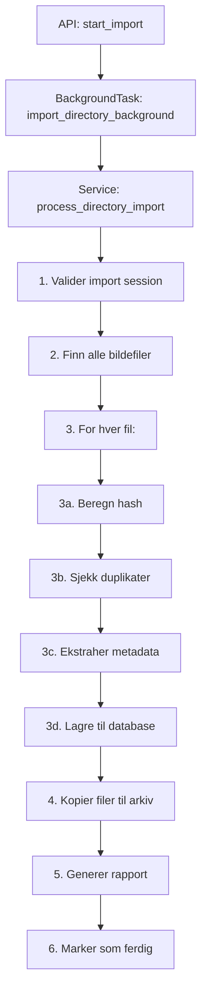

# ImaLink Import Architecture - Vedlikeholdsguide

## 🔍 **Hvor finner jeg import-logikken?**

### Hovedkomponenter (i prioritert rekkefølge):

#### 1. **Hovedorkestrering** 🎼
```
📁 src/services/import_sessions_background_service.py
   ├── process_directory_import() - HOVEDMETODE for sekvensielle oppgaver
   ├── _find_image_files() - Filskanning
   ├── _process_single_image() - Per-bilde prosessering  
   └── _copy_files_to_storage() - Fillagring og arkivering
```

#### 2. **Metadata-behandling** 📊
```
📁 src/services/importing/image_processor.py
   ├── extract_metadata() - EXIF/GPS/dimensjoner
   ├── _extract_date_taken() - Timestamp fra EXIF
   └── _extract_gps_coordinates() - GPS-koordinater
```

#### 3. **API-integrasjon** 🌐
```
📁 src/api/v1/import_sessions.py
   ├── start_import() - Endpoint for å starte import
   └── import_directory_background() - BackgroundTask wrapper
```

#### 4. **Database-operasjoner** 💾
```
📁 src/repositories/
   ├── import_session_repository.py - Import session CRUD
   └── image_file_repository.py - Image CRUD og duplikatsjekk
```

---

## 🛠️ **Vanlige vedlikeholdsoppgaver**

### **Legge til nytt filformat**
👉 **Fil**: `src/services/import_sessions_background_service.py`  
👉 **Metode**: `_find_image_files()` - legg til i `image_extensions`

### **Endre EXIF-behandling**
👉 **Fil**: `src/services/importing/image_processor.py`  
👉 **Metode**: `extract_metadata()` eller `_extract_*()` metodene

### **Justere import-workflow**  
👉 **Fil**: `src/services/import_sessions_background_service.py`  
👉 **Metode**: `process_directory_import()` - hovedsekvensen

### **Endre lagringsstrategi**
👉 **Fil**: `src/services/import_sessions_background_service.py`  
👉 **Metode**: `_copy_files_to_storage()` - filkopiering og struktur

### **Debugging import-problemer**
👉 **Fil**: `fase1/python_demos/import_session/` - demo-scripts for testing
👉 **Fil**: `src/testing/` - test-scripts for komponenter

---

## 📋 **Import Workflow (sekvensielle steg)**



---

## 🎯 **Rask navigasjon til vanlige oppgaver**

| Oppgave | Hovedfil | Søketerm |
|---------|----------|----------|
| **Ny filtype** | `import_sessions_background_service.py` | `image_extensions` |
| **EXIF-problem** | `image_processor.py` | `extract_metadata` |
| **Import feiler** | `import_sessions_background_service.py` | `process_directory_import` |
| **Fil-kopiering** | `import_sessions_background_service.py` | `_copy_files_to_storage` |
| **Database-feil** | `repositories/` | `ImportSessionRepository` |
| **API-endring** | `api/v1/import_sessions.py` | `start_import` |
| **Testing** | `python_demos/import_session/` | `demo_*` |

---

## ⚡ **Performance Hotspots**

1. **`_process_single_image()`** - Kjører for hver fil (kan være tusenvis)
2. **`extract_metadata()`** - EXIF-behandling kan være treg for store filer  
3. **`_copy_files_to_storage()`** - Filkopiering kan ta tid for store arkiv
4. **Hash-beregning** - MD5 av hele filen for duplikatsjekk

---

## 📚 **Relaterte dokumenter**
- `ARCHITECTURE.md` - Overordnet systemarkitektur
- `service_layer_guide.md` - Service layer patterns
- `fase1/README.md` - Prosjektoversikt