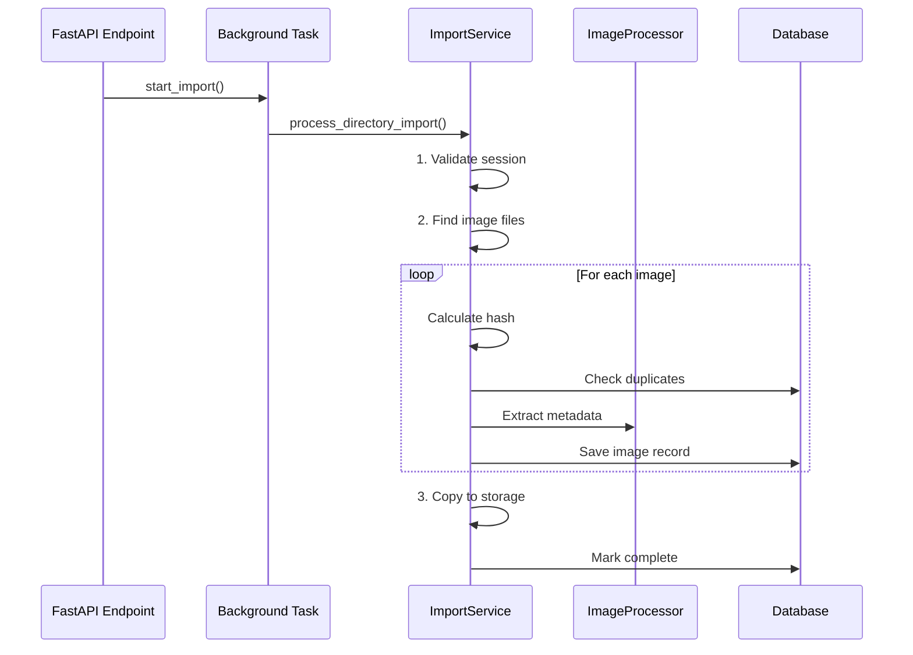

# ImaLink Import System - Utviklerguide

## 🎯 Oversikt

Import-systemet i ImaLink håndterer omfattende sekvensielle oppgaver for bildeprosessering og arkivering. Denne guiden hjelper deg med å finne fram i koden og utføre vanlige vedlikeholdsoppgaver.

## 📁 Hovedkomponenter

### 🔥 **Kjernelogikk**
```
📂 src/services/import_sessions_background_service.py
└── ImportSessionsBackgroundService
    ├── process_directory_import()     ← HOVEDMETODE (sekvensielle oppgaver)
    ├── _find_image_files()           ← Filskanning 
    ├── _process_single_image()       ← Per-bilde prosessering
    └── _copy_files_to_storage()      ← Arkivering
```

### 📊 **Metadata-behandling**
```
📂 src/services/importing/image_processor.py  
└── ImageProcessor
    ├── extract_metadata()            ← EXIF/GPS/dimensjoner
    ├── _extract_date_taken()         ← Timestamp fra EXIF
    └── _extract_gps_coordinates()    ← GPS-koordinater
```

### 🌐 **API Integration**
```
📂 src/api/v1/import_sessions.py
├── start_import()                    ← REST endpoint
└── import_directory_background()     ← FastAPI BackgroundTask
```

## 🔄 Import Workflow



## 🛠️ Vanlige Vedlikeholdsoppgaver

### ➕ **Legge til nytt filformat**

**Hvor:** `src/services/import_sessions_background_service.py`  
**Metode:** `_find_image_files()`  
**Linje:** ~104

```python
# Legg til ny extension i image_extensions set
image_extensions = {'.jpg', '.jpeg', '.png', '.tiff', '.tif', '.bmp', '.webp', 
                   '.dng', '.raw', '.cr2', '.nef', '.arw', '.heic'}  # ← Ny type her
```

### 🔧 **Endre EXIF-behandling**

**Hvor:** `src/services/importing/image_processor.py`  
**Metode:** `extract_metadata()` eller `_extract_*()` metodene

```python
# For nye EXIF-tags eller GPS-format
def _extract_custom_metadata(self, exif) -> Optional[str]:
    # Legg til custom logic her
    pass
```

### ⚡ **Performance-tuning**

**Hotspots:**
1. `_process_single_image()` - Kjører for hver fil
2. `extract_metadata()` - EXIF-parsing kan være treg
3. Hash-beregning - MD5 av hele filen
4. `_copy_files_to_storage()` - Filkopiering

**Tips:**
- Batch database commits
- Parallellisér metadata-ekstraksjjon
- Bruk raskere hash-algoritmer for store filer

### 🐛 **Debugging Import-problemer**

**Quick diagnostics:**
```bash
cd scripts/maintenance/
python import_system_maintenance.py
```

**Demo testing:**
```bash
cd python_demos/import_session/
uv run demo_jpg_dng.py
```

**Unit testing:**
```bash
cd tests/
python run_unit_tests.py
```

## 📋 Feilsøking

### ❌ **Import feiler umiddelbart**
1. Sjekk `import_system_maintenance.py health`
2. Valider source_path eksisterer
3. Sjekk database-tilkobling

### 🐌 **Import går sakte** 
1. Sjekk filstørrelse og antall
2. Monitor `_process_single_image()` performance
3. Vurder database-indekser for duplikatsjekk

### 💾 **Storage-problemer**
1. Valider storage-path permissions
2. Sjekk disk-plass
3. Test `_copy_files_to_storage()` logic

## 🧪 Testing

### **Demo System**
```bash
cd python_demos/import_session/
uv run demo_jpg_dng.py        # Test JPG/DNG import
```

### **Unit Tests**
```bash
cd tests/
python run_unit_tests.py             # Run all modern unit tests
pytest tests/api/                    # API layer tests
pytest tests/services/               # Service layer tests
```

### **Integration Tests**
```bash
cd tests/integration/
pytest test_full_import_workflow.py  # Complete workflow
```

## 🎯 Arkitektur-prinsipper

### ✅ **Godt isolerte aspekter:**
- Service Layer separasjon (API ↔ Service ↔ Repository)
- Modulær ImageProcessor for metadata
- Dependency injection via FastAPI
- Clear repository pattern for database

### ⚠️ **Forbedringspotensial:**
- Database-avhengighet kunne vært abstrahert
- Filsystem-operasjoner kunne vært interface-basert
- Konfigurasjon kunne vært dependency-injected

## 📚 Relaterte Dokumenter

- `docs/IMPORT_ARCHITECTURE.md` - Detaljert arkitekturdokumentasjon
- `ARCHITECTURE.md` - Overordnet systemarkitektur  
- `docs/service_layer_guide.md` - Service layer patterns
- `scripts/maintenance/import_system_maintenance.py` - Vedlikeholdsscripts

---

## 🚀 Quick Start for Developers

1. **Forstå hovedworkflow:** Les `process_directory_import()` i `ImportSessionsBackgroundService`
2. **Test systemet:** Kjør `python_demos/import_session/demo_jpg_dng.py`
3. **Sjekk helse:** Kjør `scripts/maintenance/import_system_maintenance.py`
4. **Debug problemer:** Bruk test-scripts i `src/testing/`

**Hovedregel:** Alt som handler om sekvensielle import-oppgaver finner du i `ImportSessionsBackgroundService` 🎯